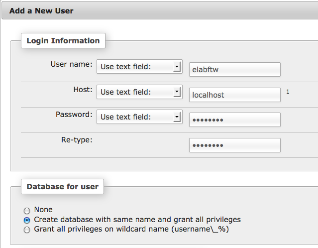

.. _install-oldschool:

Install without Docker
======================

.. image:: img/gnulinux.png
    :align: center
    :alt: gnulinux

Prerequisites
-------------

.. warning:: This method is deprecated. Only use it if you cannot install Docker!

Please refer to your distribution's documentation to install :

* A webserver (like nginx, Apache, lighttpd, cherokee or caddy)
* PHP version > 5.6
* MySQL version > 5.5
* Git (optional but recommended)

.. tip:: If you don't know how to do that, or can't update php, have a look at :ref:`installing eLabFTW on a drop <install-drop>` or :ref:`in a docker container <install>`.

.. note:: I wouldn't recommend HHVM because Gettext support is not here yet (see `this issue <https://github.com/facebook/hhvm/issues/1228>`_). Also, PHP 7 is here and is fast.

Getting the files
-----------------

The first part is to get the `eLabFTW` files on your server.

Option 1 : Using git
^^^^^^^^^^^^^^^^^^^^

This is the preferred method as it allows easier updating.

Connect to your server with SSH:

.. code-block:: bash

    $ ssh user@12.34.56.78

`cd` to the public directory where you want `eLabFTW` to be installed (can be /var/www/html, ~/public\_html, or any folder you'd like, as long as the webserver is configured properly, in doubt use /var/www/html)

.. code-block:: bash

    $ cd /var/www/html
    # make the directory writable by your user (if it's not already the case)
    $ sudo chown `whoami`:`whoami` .

Note the `.` at the end that means `current folder`.

Get latest stable version via git:

.. code-block:: bash

    $ git clone --depth 1 https://github.com/elabftw/elabftw.git

(this will create a folder `elabftw`)
The `--depth 1` option is to avoid downloading the whole history.

.. tip:: If you cannot connect, it's probably the proxy setting missing; try one of these two commands:

    .. code-block:: bash

        $ export https_proxy="proxy.example.com:3128"
        $ git config --global http.proxy http://proxy.example.com:8080

Option 2 : Download archive
^^^^^^^^^^^^^^^^^^^^^^^^^^^

Download the latest release from `this page <https://github.com/elabftw/elabftw/releases/latest>`_ as a zip archive or a tarball.

Copy it to your server with FTP or SCP, or directly wget it from the server.

SQL part
--------

The second part is putting the database in place.

Option 1: Command line way
^^^^^^^^^^^^^^^^^^^^^^^^^^

.. code-block:: bash

    # first we connect to mysql
    $ mysql -u root -p
    # we create the database (note the ; at the end !)
    mysql> create database elabftw;
    # we create the user that will connect to the database.
    mysql> grant usage on *.* to elabftw@localhost identified by 'YOUR_PASSWORD';
    # we give all rights to this user on this database
    mysql> grant all privileges on elabftw.* to elabftw@localhost;
    mysql> exit

You will be asked for the password you put after `identified by` three lines above.

Option 2: Graphical way with phpmyadmin
^^^^^^^^^^^^^^^^^^^^^^^^^^^^^^^^^^^^^^^

You need to install the package `phpmyadmin` if it's not already done.

.. note:: It is not recommended to have phpmyadmin installed on a production server (for security reasons).

.. code-block:: bash

    $ sudo apt-get install phpmyadmin

Now you will connect to the phpmyadmin panel from your browser on your computer. Type the IP address of the server followed by /phpmyadmin.

Example : https://12.34.56.78/phpmyadmin

Login with the root user on PhpMyAdmin panel (use the password you setup for mysql root user).

Create a user `elabftw` with all rights on the database `elabftw`.

Now click the `Users` tab and click:

.. image:: img/adduser.png

Do like this:

Final step
----------

Finally, point your browser to the install folder (install/) and read onscreen instructions.

For example: https://12.34.56.78/elabftw/install

Please report bugs on `github <https://github.com/elabftw/elabftw/issues>`_.

It's a good idea to subscribe to `the newsletter <http://elabftw.us12.list-manage1.com/subscribe?u=61950c0fcc7a849dbb4ef1b89&id=04086ba197>`_, to know when new releases are out (you can also see that from the Sysadmin panel).

~Thank you for using `eLabFTW <http://www.elabftw.net>`_ :)
