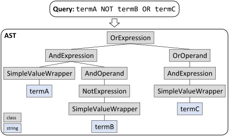

## Overview

The advanced search query converts user input to a valid SQL where clause. This is achieved with the help of a parser. The parser is generated programmatically with [Peggy](https://github.com/peggyjs/peggy) and the [PHPeggy](https://github.com/marcelbolten/phpeggy) plugin. Peggy uses [parsing expression grammar](http://en.wikipedia.org/wiki/Parsing_expression_grammar) (PEG) formalism.

The grammar file `src/node/grammar/queryGrammar.pegjs` is the input for the parser compilation and uses [Peggy v.1.0.0 grammar syntax and semantics](https://github.com/peggyjs/peggy/tree/v1.0.0#grammar-syntax-and-semantics). The parser is compiled at build-time and located at `src/Services/AdvancedSearchQuery/Grammar/Parser.php`.

The parser will build an abstract syntax tree AST with the grammar elements (PHP classes) located in `src/services/advancedSearchQuery/grammar/`: `AndExpression`, `AndOperand`, `DateField`, `Field`, `NotExpression`, `OrExpression`, `OrOperand`, `SimpleValueWrapper`, and `TimestampField`. The grammar file defines the hierarchy of the grammar elements but additionally the hierarchy is reflected by the parameter type hinting.

After the AST is build successfully (syntax errors are reported to the user) it can be visited. Here the visitor pattern is used and there are tree visitors located in `src/services/advancedSearchQuery/visitors`: `DepthValidatorVisitor`, `FieldValidatorVisitor`, and `QueryBuilderVisitor`.

1. `DepthValidatorVisitor` checks the complexity of the query. How deep it the AST? (Not used currently.)
2. `FieldValidatorVisitor` checks if fields/values are allowed, e.g., the `timestamped` field is only meaningful for experiments or items. Feedback is given for illegal fields/values.
3. `QueryBuilderVisitor` is the workhorse and builds the SQL where clause.

The `FieldValidatorVisitor` and `QueryBuilderVisitor` use collectors (`src/services/advancedSearchQuery/collectors`) to collect all the invalid fields and the where clause, respectively.

`VisitorParameters` can be used to inject additional data into the AST, e.g., the entity type to check if a field (`timestamped`) is allowed for experiments/database.

`src/services/AdvancedSearchQuery.php` brings together the three steps, parsing/AST building, validation, and SQL where clause generation.

## How to add a field `new_field` to the grammar
- modify the grammar file `src/node/grammar/queryGrammar.pegjs`
- modify or add the necessary files in `src/services/advancedSearchQuery/`
  - add `new_field` to `src/services/advancedSearchQuery/enums/Fields.php`
  - add a class method named `visitFieldNew_field` to visitor `src/services/advancedSearchQuery/visitors/FieldValidatorVisitor.php` and maybe add some data validation steps
  - add a class method named `visitFieldNew_field` to visitor `src/services/advancedSearchQuery/visitors/QueryBuilderVisitor.php` and add the necessary SQL `WHERE` fragment to it
- reflect the changes of the grammar also in the highlighter `src/ts/prism-elabftwquery.ts`
- add a user query fragment to the unit test `tests/unit/services/AdvancedSearchQueryTest.php`, e.g.: `new_field:"test query"`
- update the search syntax documentation `src/templates/search-help-modal.html`

This is not a comprehensive set of instructions that will work for all fields. There can be more complex code changes like for example for the date or timestamp fields. In this cases the new grammar classes (`src/services/advancedSearchQuery/grammar`) and interfaces (`src/services/advancedSearchQuery/interfaces/`) also need to be added/extended.
